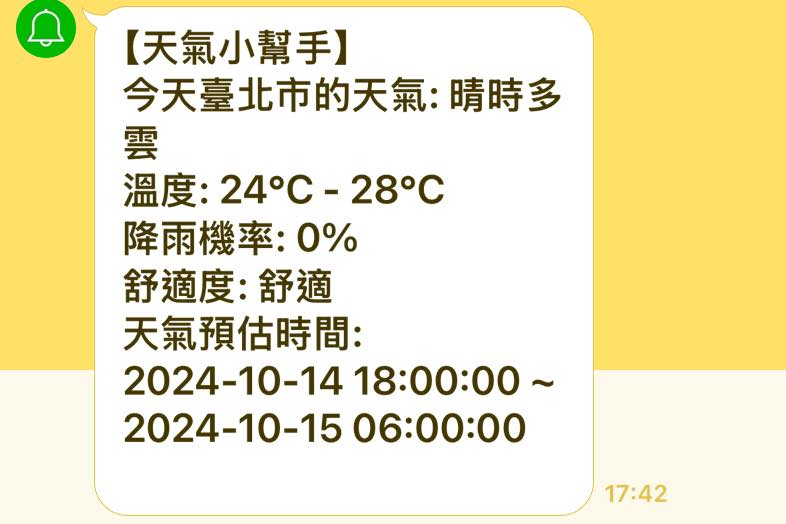

# Weatherapp

## 專案介紹

你是否經常在下雨時忘記帶傘呢？

台灣作為海島型國家，天氣變幻莫測，再加上近年來極端氣候的影響，

有時候一天內的天氣變化多端，讓人感覺彷彿經歷了春夏秋冬四季的輪轉。

因此，你需要一個天氣的小工具 -- Weatherapp

## 專案特色

此專案的天氣資料取自於中央氣象署開放資料平臺 https://opendata.cwa.gov.tw/dist/opendata-swagger.html#/

結合 Line notify，將天氣資料推播至用戶的 Line

## 專案所需指令

`poetry shell`
`poetry install`

新增 .env

取得 中央氣象局 api 的憑證 https://opendata.cwa.gov.tw/index ，並將憑證放置.env 的 Authorization

取得 line notify 的 token https://notify-bot.line.me/doc/en/ ，再將取得的 token 放置.env 的 line_notify_token
